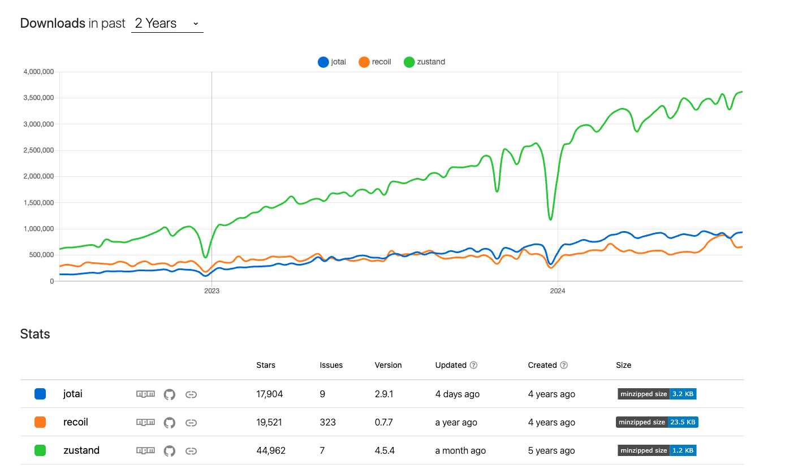

# 5장 리액트와 상태관리 라이브러리

## 상태 관리는 왜 필요한가?

`상태` : 어떠한 의미를 지닌 값이며 애플리케이션의 시나리오에 따라 지속적으로 `변경될 수 있는 값`

**상태값의 예시**

`UI` : 상호 작용이 가능한 모든 요소의 현재 값

`URL` : 브라우저에서 관리되고 있는 상태값.

`폼(form)` : loading, submit, disabled , validation

`서버에서 가져온 값` : 클라이언드에서 서버로 요청을 통해 가져온 값

기타 등등...

### Flux 패턴의 등장


`액션(action)`

어떠한 작업을 처리할 액션과 그 액션 발생 시 함께 포함시킬 데이터.

액션 타입과 데이터를 각각 정의해 이를 디스패처로 보낸다.

`디스패처(dispatcher)`

액션을 스토어에 보내는 역할.

콜백 함수 형태로 앞서 액션이 정의한 타입과 데이터를 모두 스토어에 보낸다.

`스토어(store)`

여기서에서 실제 상태에 따른 값과 상태를 변경할 수 있는 메서드를 가지고 있다.

액션의 타입에 따라 어떻게 이를 변경할지가 정의

`뷰(view)`

리액트의 컴포넌트에 해당하는 부분으로, 스토어에서 만들어진 데이터를 가져와 화면을 렌더링하는 역할

또한 뷰에서도 사용자의 입력이나 행위에 따라 상태를 업데이트하고자 할 수 있을 것이다.

```jsx
import { useReducer } from "react";

type StoreState = {
  count: number,
};

type Action = {
  type: "add",
  payload: number,
};

function reducer(prevState: StoreState, action: Action) {
  const { type: ActionType } = action;

  if (ActionType === "add") {
    return { count: prevState.count + action.payload };
  }
  throw new Error(`Unexpected Action [${ActionType}]`);
}

export default function App() {
  const [state, dispatcher] = useReducer(reducer, { count: 0 });

  function handleClick() {
    dispatcher({ type: "add", payload: 1 });
  }

  return (
    <div>
      <h1>{state.count}</h1>
      <button onClick={handleClick}>++</button>
    </div>
  );
}
```

`type Action` : 액션이 어떤 종류가 있고 어떤 데이터를 필요로 하는지 정의

`useReducer`, `reducer` : 스토어 역할, 각각 현재 상태와 상태에 따른 값이 어떻게 변경되는지를 정의

`dispatcher` : 액션 실행

`view` : App

데이터의 흐름이 모두 액션이라는 한 방향(단방향)으로 줄어듦으로 데이터의 흐름을 추적하기 쉽고 코드를 이해하기가 수월

## 리덕스(redux)

Elm 아키텍처

`모델(model)` : 애플리케이션의 상태를 의미

`뷰(view)` : 모델을 표현하는 HTML을 의미

`업데이트(update)` : 모델을 수정하는 방식

장점

- 하나의 상태 객체를 스토어에 저장하여 = 하나의 글로벌 상태 객체
- 하위 컴포넌트에 props drilling 문제 해결
- 필요한 컴포넌트에서 연결만 맺어 스토어에 접근 가능

단점

- 하고자 하는 일에 비해 보일러플레이트가 너무 많다 -> 단순히 하나의 상태를 바꾸기 위해 해야 할 일이 多

그럼에도 불구하고 이점이 더 컸기 때문에 많이 활용되었음

## Context API와 useContext

전역 상태를 `하위 컴포넌트에 주입`할 수 있는 Context API

Provider로 상태를 주입하여 원하는 값을 props로 넘격주지 않아도 사용가능해짐

`BUT`, Context API는 상태 관리가 아닌 주입을 도와주는 기능이며, 렌더링을 막아주는 기능 또한 존재하지 않으니 사용할 때 주의가 필요

## 훅의 탄생, React Query와 SWR

SWR 코드 예시

```jsx
import useSWR from "swr";

const fetcher = (url: string) => fetch(url).then((res) => res.json());

export default function App() {
  const { data, error } = useSWR(
    "https://api.github.com/repos/vercel/swr",
    fetcher
  );

  if (error) return "An error has occurred.";
  if (!data) return "Loading...";

  return (
    <div>
      <p>{JSON.stringify(data)}</p>
    </div>
  );
}
```

첫번째 인수 : 조회할 API 주소

두번째 인수 : 조회에 사용되는 fetch

React Query 예시

```jsx
import {
  QueryClient,
  QueryClientProvider,
  useQuery,
} from "@tanstack/react-query";

const queryClient = new QueryClient();

export default function App() {
  return (
    <QueryClientProvider client={queryClient}>
      <Example />
    </QueryClientProvider>
  );
}

function Example() {
  const { isPending, error, data } = useQuery({
    queryKey: ["repoData"],
    queryFn: () =>
      fetch("https://api.github.com/repos/TanStack/query").then((res) =>
        res.json()
      ),
  });

  if (isPending) return "Loading...";

  if (error) return "An error has occurred: " + error.message;

  return (
    <div>
      <h1>{data.name}</h1>
      <p>{data.description}</p>
      <strong>👀 {data.subscribers_count}</strong>{" "}
      <strong>✨ {data.stargazers_count}</strong>{" "}
      <strong>🍴 {data.forks_count}</strong>
    </div>
  );
}
```

`useQuery` 훅 사용
첫번째 인수 : 고유 key 값 (refetch, cache 등에 사용)

두번째 인수 : 조회에 사용되는 fetch 함수

## Recoil, Zustand, Jotai, Valtio에 이르기까지

기존의 리덕스와는 다르게 훅을 활용해 작은 크기의 상태를 효율적으로 관리

# 리액트 훅으로 시작하는 상태 관리

기본 훅 : `useState`와 `useReducer`

```jsx
import { useState } from "react";

function useCounter(initCount: number = 0) {
  const [counter, setCounter] = useState(initCount);

  function inc() {
    setCounter((prev) => prev + 1);
  }

  return { counter, inc };
}
```

`useReducer`를 `useState`로 작성

```tsx
import { useCallback, useState } from "react";

function useReducerWithUseState(reducer, initialState, initializer) {
  const [state, setState] = useState(
    initializer ? initializer(initialState) : initialState
  );

  const dispatch = useCallback(
    (action) => setState((prev) => reducer(prev, action)),
    [reducer]
  );

  return [state, dispatch];
}
```

**useState와 useReducer를 기반으로 하는 사용자 지정 훅의 한계**

- 컴포넌트별로 초기화되므로 컴포넌트에 따라 서로 다른 상태를 가질 수 밖에 없다.

- 컴포넌트별로 상태의 파편화를 만들어 버림

- 기본적인 useState를 기반으로 한 상태 = `지역 상태` (local state)

지역 상태를 `전역 상태`(global state)로 만들어 컴포넌트가 사용하는 모든 훅이 동일한 값을 참조할 수 있게 하려면

→ 상태를 컴포넌트 밖으로 한 단계 끌어올리면 됨

but, 이렇게 되면 `컴포넌트 트리를 재설계`하는 등의 수고로움이 필요

그렇다면 이러한 문제를 어떻게 해결할 수 있을까?

1. `useState`, `useReducer`가 가지고 있는 한계, 컴포넌트 내부에서만 사용할 수 있는 `지역상태라는 점`을 극복하기 위해 외부 어딘가에 상태를 둔다. 이는 컴포넌트의 최상단 내지는 상태가 필요한 부모가 될 수도 있고, 혹은 격리된 자바스크립트 스코프 어딘가일 수도 있다.

2. 이 외부의 상태 변경을 각자의 방식으로 감지해 컴포넌트의 렌더링을 일으킨다.

## 상태 관리 라이브러리 Recoil, Jotai, Zustand 알아보기

`Recoil`과 `Jotai`는 Context와 Provider, 그리고 훅을 기반으로 가능한 작은 상태를 효율적으로 관리하는 데 초점을 맞추고 잇다.

`Zustand`는 리덕스와 비슷하게 하나의 큰 스토어를 기반으로 상태를 관리하는 라이브러리

Context가 아니라 스토어가 가지는 클로저를 기반으로 생성되며, 스토어의 상태가 변경되면 이상태를 구독하고 잇는 컴포넌트에 전파해 리렌더링을 알린다.

### Recoil

**RecoilRoot**

애플리케이션 최상단에 선언

```jsx
function App() {
  return (
    <RecoilRoot>
      <SomeComponents />
    </RecoilRoot>
  );
}
```

용도 : Recoil에서 생성되는 상태값을 저장하기 위한 스토어를 생성

Recoil의 상태값은 RecoilRoot로 생성된 Context의 스토어에 저장된다.

스토어의 상태값에 접근할 수 있는 함수들이 있으며, 이 함수를 활용해 상태값에 접근하거나 상태값을 변경할 수 있다.

값의 변경이 발생하면 이를 참조하고 있는 하위 컴포넌트에 모두 알린다.

**atom**

```jsx
const textState = atom({
  key: "textState", // unique ID (with respect to other atoms/selectors)
  default: "", // default value (aka initial value)
});
```

key값은 필수, 다른 atom과 구별되는 식별자가 되는 필수 값

default는 atom의 초깃값

**useRecoilValue**

atom의 값을 읽어오는 훅

```jsx
import {atom, selector, useRecoilValue} from 'recoil';

const namesState = atom({
  key: 'namesState',
  default: ['', 'Ella', 'Chris', '', 'Paul'],
});

const filteredNamesState = selector({
  key: 'filteredNamesState',
  get: ({get}) => get(namesState).filter((s tr) => str !== ''),
});

function NameDisplay() {
  const names = useRecoilValue(namesState);
  const filteredNames = useRecoilValue(filteredNamesState);

  return (
    <>
      Original names: {names.join(',')}
      <br />
      Filtered names: {filteredNames.join(',')}
    </>
  );
}
```

**useRecoilState**

useState와 유사하게 값을 가져오고, 또 이 값을 변경할 수도 있는 훅

```jsx
import { atom, selector, useRecoilState } from "recoil";

const tempFahrenheit = atom({
  key: "tempFahrenheit",
  default: 32,
});

const tempCelsius = selector({
  key: "tempCelsius",
  get: ({ get }) => ((get(tempFahrenheit) - 32) * 5) / 9,
  set: ({ set }, newValue) => set(tempFahrenheit, (newValue * 9) / 5 + 32),
  // get과 set할 때는 atom 변수명을 호출하면 된다.
});

function TempCelsius() {
  const [tempF, setTempF] = useRecoilState(tempFahrenheit);
  const [tempC, setTempC] = useRecoilState(tempCelsius);

  const addTenCelsius = () => setTempC(tempC + 10);
  const addTenFahrenheit = () => setTempF(tempF + 10);

  return (
    <div>
      Temp (Celsius): {tempC}
      <br />
      Temp (Fahrenheit): {tempF}
      <br />
      <button onClick={addTenCelsius}>Add 10 Celsius</button>
      <br />
      <button onClick={addTenFahrenheit}>Add 10 Fahrenheit</button>
    </div>
  );
}
```

**selector**

atom값을 바탕으로 새로운 값을 조립할 수 있는 API

```jsx
const filteredTodoListState = selector({
  key: "filteredTodoListState",
  get: ({ get }) => {
    const filter = get(todoListFilterState);
    const list = get(todoListState);

    switch (filter) {
      case "Show Completed":
        return list.filter((item) => item.isComplete);
      case "Show Uncompleted":
        return list.filter((item) => !item.isComplete);
      default:
        return list;
    }
  },
});
```

```jsx
const toggleState = atom({ key: "Toggle", default: false });

const mySelector = selector({
  key: "MySelector",
  get: ({ get }) => {
    const toggle = get(toggleState);
    if (toggle) {
      return get(selectorA);
    } else {
      return get(selectorB);
    }
  },
});
```

### Jotai

**atom**

최소 단위의 상태

atom 하나만으로도 상태를 만들 수도, 이에 파생된 상태를 만들 수도 있다.

```jsx
const countAtom = atom(0);
```

recoil과 달리 atom을 생성할 때 `별도의 key를 넘겨주지 않아도` 됨

**useAtomValue**

```jsx
const countAtom = atom(0);

const Counter = () => {
  const setCount = useSetAtom(countAtom);
  const count = useAtomValue(countAtom);

  return (
    <>
      <div>count: {count}</div>
      <button onClick={() => setCount(count + 1)}>+1</button>
    </>
  );
};
```

`useAtomValue`는 읽기 전용으로 atom을 불러올 때 사용한다.

**useSetAtom**

```jsx
const switchAtom = atom(false);

const SetTrueButton = () => {
  const setCount = useSetAtom(switchAtom);
  const setTrue = () => setCount(true);

  return (
    <div>
      <button onClick={setTrue}>Set True</button>
    </div>
  );
};

const SetFalseButton = () => {
  const setCount = useSetAtom(switchAtom);
  const setFalse = () => setCount(false);

  return (
    <div>
      <button onClick={setFalse}>Set False</button>
    </div>
  );
};

export default function App() {
  const state = useAtomValue(switchAtom);

  return (
    <div>
      State: <b>{state.toString()}</b>
      <SetTrueButton />
      <SetFalseButton />
    </div>
  );
}
```

`useSetAtom()`은 값을 읽을 필요 없이 변경할 때 사용한다.

**useAtom**

useState와 동일한 형태의 배열을 반환

```jsx
const [value, setValue] = useAtom(anAtom);
```

스토어에서 해당 atom을 찾아 직접 값을 업데이트한다. 그리고 스토어에서 새로운 값을 작성한 이후에는 해당 값의 변화에 대해 알고 있어야 하는 listener 함수를 실행해 값의 변화가 있음을 전파하고, 사용하는 쪽에서 리렌더링이 수행

(예시)

```jsx
import { Suspense } from "react";
import { atom, useAtom } from "jotai";

const userIdAtom = atom(1);
const userAtom = atom(async (get, { signal }) => {
  const userId = get(userIdAtom);
  const response = await fetch(
    `https://jsonplaceholder.typicode.com/users/${userId}?_delay=2000`,
    { signal }
  );
  return response.json();
});

const Controls = () => {
  const [userId, setUserId] = useAtom(userIdAtom);
  return (
    <div>
      User Id: {userId}
      <button onClick={() => setUserId((c) => c - 1)}>Prev</button>
      <button onClick={() => setUserId((c) => c + 1)}>Next</button>
    </div>
  );
};

const UserName = () => {
  const [user] = useAtom(userAtom);
  return <div>User name: {user.name}</div>;
};

const App = () => (
  <>
    <Controls />
    <Suspense fallback="Loading...">
      <UserName />
    </Suspense>
  </>
);

export default App;
```

| Recoil                                         | Jotai                                                                   |
| ---------------------------------------------- | ----------------------------------------------------------------------- |
| 별도의 키가 필요                               | 키 관리 필요 X                                                          |
| atom에서 파생된 값을 만들기 위해 selector 필요 | selector 없이도 atom만으로 atom 값에서 또 다른 파생된 상태 만들 수 있음 |
| 아직 정식 버전 X                               | 현재 버전 v2                                                            |

## Zustand

리덕스에 영감을 받아 만들어짐

하나의 스토어를 중앙 집중형으로 활용

간단한 사용법

(공식 문서)

```jsx
import { create } from "zustand";

const useStore = create((set) => ({
  bears: 0,
  increasePopulation: () => set((state) => ({ bears: state.bears + 1 })),
  removeAllBears: () => set({ bears: 0 }),
  updateBears: (newBears) => set({ bears: newBears }),
}));
```

```jsx
function BearCounter() {
  const bears = useStore((state) => state.bears);
  return <h1>{bears} around here...</h1>;
}

function Controls() {
  const increasePopulation = useStore((state) => state.increasePopulation);
  return <button onClick={increasePopulation}>one up</button>;
}
```

(책)

```jsx
import { create } from "zustand";

const useCounterStore = create((set) => ({
  count: 1,
  inc: () => set((state) => ({ count: state.count + 1 })),
  dec: () => set((state) => ({ count: state.count - 1 })),
}));

function Counter() {
  const { count, inc, dec } = useCounterStore(); // destructuring 사용하면 훨씬 쉽게 사용 가능
  return (
    <div>
      <span>{count}</span>
      <button onClick={inc}>up</button>
      <button onClick={dec}>down</button>
    </div>
  );
}
```

**특징**

특별히 많은 코드를 작성하지 않아도 빠르게 스토어를 만들고 사용할 수 있다.

<br/>
<hr/>
2024.7.30 기준 상태 관리 라이브러리 순위 (redux 제외)
<br/>

